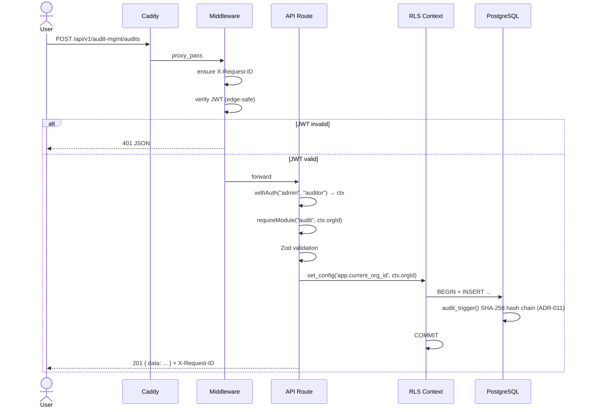
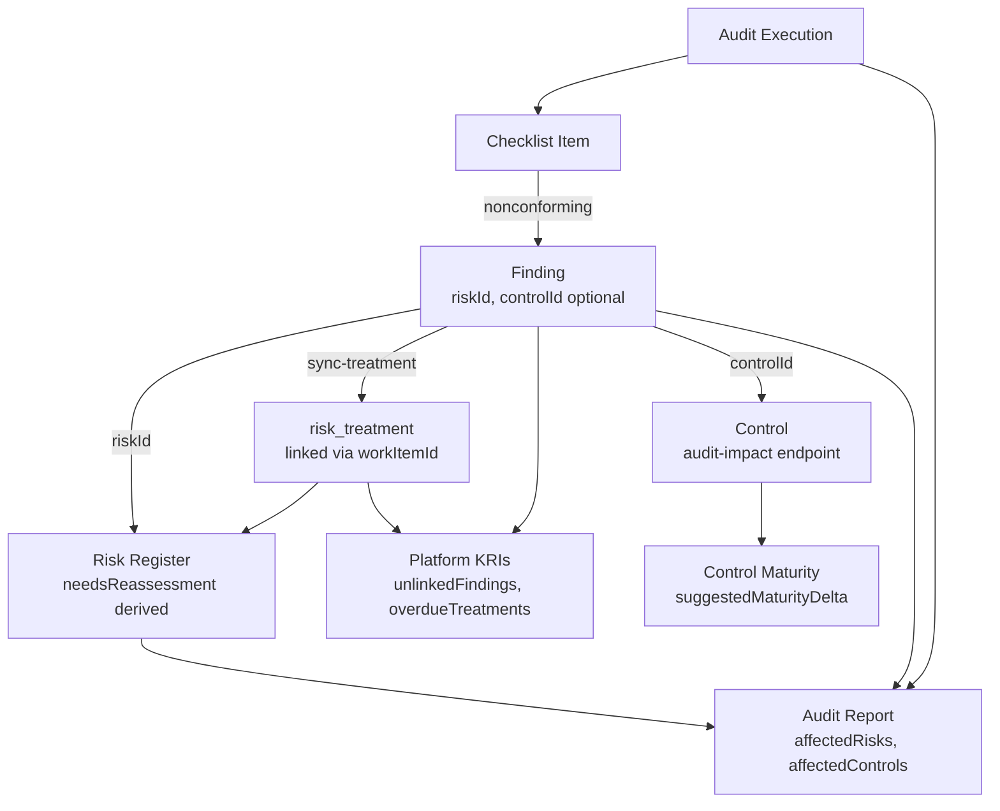
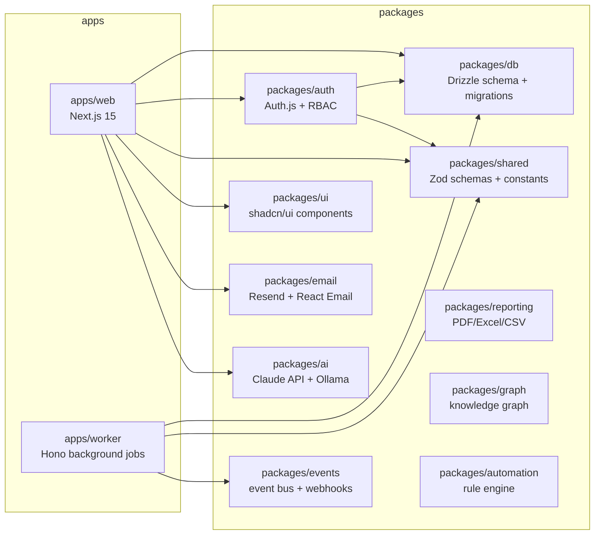

# Architecture Overview

Diagramme rendern in GitHub via Mermaid.

## Deployment (Hetzner)

```mermaid
graph TB
  User[Browser / API-Client]
  subgraph Hetzner_Host["Hetzner Dedicated (ubuntu-16gb-fsn1-1)"]
    Caddy[Caddy Reverse-Proxy<br/>TLS, :443]
    subgraph Tenants["Per-Tenant Containers"]
      WebMain[web<br/>grc_platform]
      WebDaimon[web-daimon<br/>grc_daimon]
      WebEtc[...]
    end
    PG[(PostgreSQL 16<br/>TimescaleDB, pgvector, RLS)]
    Redis[(Redis)]
  end
  subgraph Backup["Backup-Strategie (ADR-014/015)"]
    Local[/opt/arctos/backups/<br/>30d Rotation]
    B2[Backblaze B2<br/>eu-central, append-only]
  end

  User -->|HTTPS| Caddy
  Caddy -->|arctos.charliehund.de| WebMain
  Caddy -->|daimon.arctos.charliehund.de| WebDaimon
  WebMain --> PG
  WebDaimon --> PG
  WebMain --> Redis
  PG -. nightly pg_dump .-> Local
  Local -. rclone sync .-> B2
```

## Request Flow (Authenticated API)



## Multi-Entity Isolation (ADR-001)

```mermaid
graph LR
  subgraph "Session + JWT"
    JWT[JWT.user.roles = [<br/>  {orgId: ccc4..., role: admin},<br/>  {orgId: 9425..., role: admin}<br/>]]
    Cookie[Cookie arctos-org-id<br/>= 9425...]
  end
  subgraph "Server-side Resolution"
    Session[session.user.currentOrgId<br/>= cookie ? cookie : roles[0]]
  end
  subgraph "RLS Policies"
    Query[SELECT * FROM risk]
    Policy["WHERE org_id = current_setting('app.current_org_id')"]
  end

  JWT --> Session
  Cookie --> Session
  Session -->|set_config| Policy
  Query --> Policy
```

## Audit-ERM Feedback Loop (Iter 1-3)



## Monorepo



## Migration Lifecycle (ADR-014)

```mermaid
stateDiagram-v2
  [*] --> Development: Drizzle-Schema-TS-File geändert
  Development --> GenerateMigration: drizzle-kit generate
  GenerateMigration --> drizzle_folder: SQL in packages/db/drizzle/
  drizzle_folder --> PR_Review: git push + PR
  PR_Review --> CI_Green: Tests, migration-policy, schema-drift
  CI_Green --> Merge_Main: Review-Approval
  Merge_Main --> Manual_Deploy: Ops runs arctos-update
  Manual_Deploy --> Entrypoint: docker-entrypoint.sh
  Entrypoint --> DB_Applied: psql -f for drizzle/*.sql + src/migrations/*.sql
  DB_Applied --> Verify: /api/v1/health/schema-drift
  Verify --> [*]: healthy=true

  note right of drizzle_folder: ADR-014 Phase 3:<br/>neue Files NUR hier
  note right of DB_Applied: ON_ERROR_STOP=0<br/>idempotent
```

## ADRs im Überblick

Siehe [adr-index.md](./adr-index.md) für alle 15 Architektur-Entscheidungen + Links.
